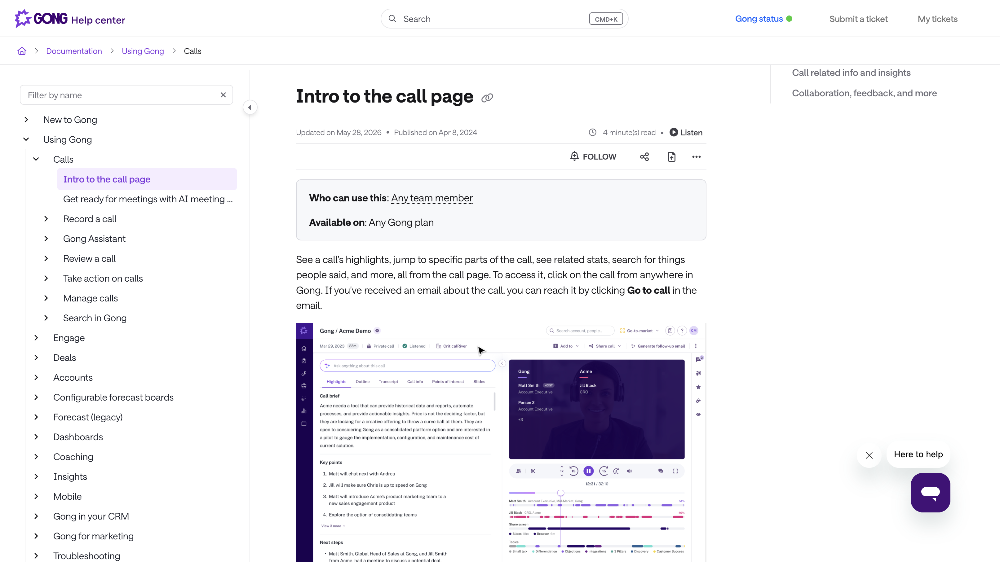
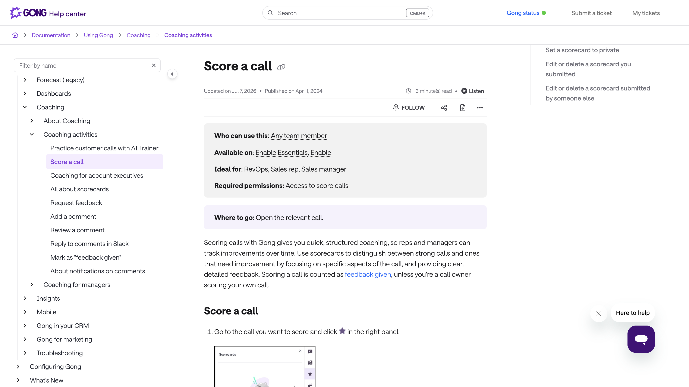
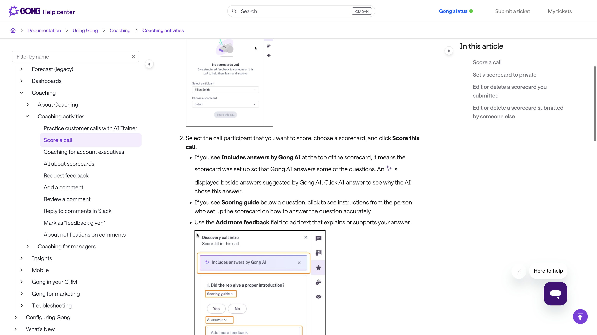

# Debrief — mécanique figée (31 août 2026)

Le geste du terrain, collé au design et au jeu. Pas un QCM. Pas un meeting. Pas une note. Ce qui fait jeu (hors note) : [jeu.md](jeu.md).

Études d’efficacité : [etude-reverse.md](etude-reverse.md). Session de pensée : [sessions/2026-08-30-7.md](sessions/2026-08-30-7.md).

**Écart au cadrage** : [deroulement.md](deroulement.md) dit encore tableau vide, dans l’appel, pas après le non. Ici le cas est un **dossier déjà là**, parfois déjà au mur. Le cadrage gagne tant qu’on n’amende pas. Cette note est la piste **tenue** pour le premier cas jouable si Édouard dit go.

## Ce que c’est

Tu reçois **tout le cas** : mails, transcripts (prospection + découverte), Slack, CRM trop sûr. Ça a l’air tenu. Dedans, **plusieurs** trous possibles. Tu lis. Puis tu sors **ton retour le plus complet** (voix 4 min, ou texte plus long). Un modèle rattache **ce que tu as nommé** (BANT, MEDDIC, MEDDPICC, BEBEDC…). Pas la checklist du dossier. Pas de score.

Le joueur est à la place du DC un lundi. Il ne croit pas le CRM. Il dit ce qui cloche **dans les pièces**, pas ce qui manque sur une grille à cocher.

## Comment ça se joue (~15 min)

| Beat | Ressenti | Écran |
| --- | --- | --- |
| 1. Dossier | ~8 min | HUD = le deal (`Call Acme — Julien, ops`). Pièces ouvertes. Pas de spoiler dans le titre. |
| 2. Retour | 4 min voix (plus long à l’écrit) | Timer. Micro ou champ. Le dossier **reste ouvert**. |
| 3. Rattachement | ~1–2 min | LLM : cite les pièces, nomme **les** trous de ta prise (il peut y en avoir plusieurs), colle la méthode. Deux lectures peuvent tenir. |
| 4. Sortie | ~1 min | Échelle si le parcours en a une + trou nommé. Pas de points. |

Voix vs écrit : **deux clocks**. 4 min à l’oral ≈ un debrief DC. 4 min à l’écrit = trois phrases. Test 1 : un mode (voix). L’écrit plus tard, ou un timer plus long.

Lire d’abord, parler ensuite. Timer avant d’avoir lu = panique, pas un AAR.

## Design

Pas le tableau vide des DA Surface. Un **deal room** : liste de pièces à gauche, pièce ouverte au centre, timer + micro en bas. Craft Linear (Surface), faits en mono. Une deal à l’écran.

Pas de chat avec le modèle. Pas d’avatar. Le vocal est une **entrée**, comme tu parles à ton DC. Après le timer, l’écran de sortie — pas un fil.

## Ce que le LLM fait / ne fait pas

Fait : transcrire ; comparer le retour **et** le dossier ; citer (« call du 12, Julien dit… ») ; rattacher (MEDDIC Economic Buyer = BANT Authority = BEBEDC Décideurs) ; accepter deux lectures honnêtes.

Ne fait pas : noter 7/10 ; cocher les huit lettres ; une copie gold dans le prompt ; discuter.

Coût : Sonnet 5 ~ 2 $ / MTok in, 10 $ out, cache 0,20 $. Dossier en cache + un vocal = **centimes**. Pas le bloqueur.

## Marketing — AAR, pas camouflage

À figer pour la landing / le mail, **pas** pour l’écran du cas (HUD = le deal).

La forme d’apprentissage, c’est l’**after-action review** de l’armée : preuves, tu dis ce que tu as vu, on nomme ce qui s’est passé, prochaine fois. Les ingénieurs debriefent un incident de la même façon. Les méthodes (MEDDIC, BANT…) sont le **lexique**. Le rituel, c’est l’AAR.

Ça parle aux gens qui ne sont pas « nés sales » : on n’apprend pas des punchlines. On apprend comme on debriefe un crash, un bug, un exercice. Générations qui reculent devant le commercial qui « a le bagou » — ici le bagou ne compte pas. Le dossier, si.

**Dire :** on debriefe un deal comme un ingénieur debriefe un incident. Méthodes commerciales, rituel d’armée / d’ingé.

**Ne pas dire :** forces spéciales, camouflage, « on forme comme le SOF », module MEDDIC, certif. Le costume tue le positionnement (anti-réf Trailhead / Academy). [design.md](design.md).

Google / mail : toujours le **cas** (`DAF dit non`). L’AAR est le *comment*, pas la query.

## Gong — le cousin, sur de vrais appels

Gong enregistre les **vrais** appels de l’entreprise (visio, tel, calendrier). Ensuite ce n’est pas un quiz pour le rep seul. C’est un **outil de manager** + IA, sur *ton* pipe.

Sources : [call page](https://help.gong.io/docs/intro-to-the-call-page), [review a call](https://help.gong.io/docs/review-what-happened-in-a-call), [score a call](https://help.gong.io/docs/score-a-call), [coaching workflows](https://help.gong.io/docs/create-coaching-workflows). Captures : help Gong, 31 août 2026.

### Après l’enregistrement, dans l’ordre

1. **Call page.** Titre, compte, durée. Gauche : Highlights (brief, key points, next steps), Outline, Transcript, Call info, Points of interest, Slides. Droite : player + timeline locuteurs + topics (pricing, objections…). En haut : *Ask anything about this call*.

2. **L’IA résume.** Recap, bullets, next steps, citations vers le moment. Points of interest : playbook, questions, trackers, filler words. Gong Assistant : chat sur *ce* transcript.

3. **Coaching humain.** Commentaire horodaté sur une réplique. Le rep tague son manager. *Request feedback* / *Mark as feedback given*. Inbox coaching, digest hebdo, métriques (calls écoutés, commentés, scorés). Recommandation Gong : **un call scoré par rep et par semaine**.

4. **Scorecards.** C’est « l’audit ». Étoile sur le call → choisir le participant → une grille. Questions du type *Did the rep give a proper introduction?* **Yes / No**, scoring guide, champ « add more feedback ». Gong AI peut **pré-remplir**. Score global 0–100, pondéré. Public / privé.

5. **À côté.** Deal board (risque d’après les convs), libraries de « bons » appels, AI Trainer (roleplay — meeting, on n’en veut pas).

### Ce qu’on vole / ce qu’on refuse

| Gong | 3xrep |
| --- | --- |
| Vrais appels de *ta* boîte | Cas fictif, complet, rejouable |
| Manager + scorecard Yes/No + note | Toi, 4 min, rattachement, **pas de note** |
| Talk ratio, filler, patience | Pas des stats de bouche |
| Entreprise, sièges, 30–60 j de data | Un mail, un cas, 15 min |
| L’IA coche la grille | L’IA nomme le trou **après** que tu as parlé |

Même objet : une conv comme **preuve**. Gong la donne au manager pour scorer. Nous on la donne au commercial pour **debriefer**, comme l’AAR. Le Yes/No Gong (*proper introduction?*) est exactement le QCM qu’on ne fait pas.

## Apprendre — rappel court

AAR : +20–25 % sur la fois d’après (méta). En vente : pas d’essai sur un cas fictif + vocal ; le cousin est le coaching structuré (CSO Insights, ~27 % win rate) — Gong + manager, pas un produit 15 min. Kill switch 3xrep inchangé : 20 commerciaux, semaine 2.

Sans prochain cas, c’est du M&M (tu te sens malin). Le test a besoin de **cas qui changent**.

## Interdit dans ce geste

QCM à 4 options. Note / palier. Chat. Meeting / bot. Spoiler dans le titre. Une seule lecture « correcte ». Timer avant d’avoir lu. Camouflage militaire sur l’écran du deal.
